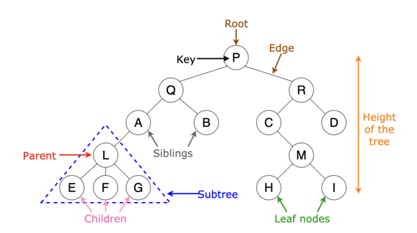

# Tree 트리

트리(Tree)는 노드와 에지로 연결된 그래프의 특수한 형태다.</br>
트리 자료구조는 데이터의 탐색 효율이 높다.</br>
다음과 같은 특징을 갖는다.
1. 순환 구조(cycle)이 없고, 루트 노드는 1개만 존재한다.</br>
2. 루트 노드 이외의 노드는 1개의 부모 노드를 갖는다.</br>
3. 트리의 부분 트리는 트리의 특징을 따른다.



|구성 요소| 설명 |
|--------|------|
|노드|데이터의 index, value를 표현|
|에지|노드와 노드의 연결 관계르 나타내는 선|
|루트 노드|최상위 노드|
|부모 노드|두 노드 중 상위 노드에 해당하는 노드|
|자식 노드|두 노드 중 하위 노드에 해당하는 노드|
|리프 노드|최하위 노드|
|서브 트리|전체 트리에 속한 작은 트리|

트리는 그래프의 특수한 형태이므로, 이전에 그래프를 표현하는 3가지 방식으로 표현할 수 있다. Java에서는 애초에 트리 자료구조를 제공하기도 한다.
</br>
트리 형태의 그래프를 활용한 가장 간단한 문제는 아래와 같다.</br>
백준 [트리의 부모 찾기](https://www.acmicpc.net/problem/11725)
```
package own;

import java.io.BufferedReader;
import java.io.InputStreamReader;
import java.util.ArrayList;
import java.util.Arrays;
import java.util.LinkedList;
import java.util.PriorityQueue;
import java.util.Queue;
import java.util.StringTokenizer;

public class 복습 {
	static boolean[] visit;
	static ArrayList<Integer>[] A;
	static int[] answer;
	public static void main(String[] args) throws Exception{
		BufferedReader br = new BufferedReader(new InputStreamReader(System.in));
		int N = Integer.valueOf(br.readLine());
		A = new ArrayList[N+1];
		answer = new int[N+1];
		visit = new boolean[N+1];
		for(int i = 1; i<N+1; i++)
			A[i] = new ArrayList<Integer>();
		for(int i = 0; i<N-1; i++) {
			StringTokenizer st = new StringTokenizer(br.readLine());
			int a = Integer.valueOf(st.nextToken());
			int b = Integer.valueOf(st.nextToken());
			A[a].add(b);
			A[b].add(a);
		}
		DFS(1);
		for(int i = 2; i<N+1; i++)
			System.out.println(answer[i]);
	}
	private static void DFS(int n) {
		visit[n] = true;
		for(int i : A[n]) {
			if(visit[i]) continue;
			answer[i] = n;
			DFS(i);
		}
	}
}


```


