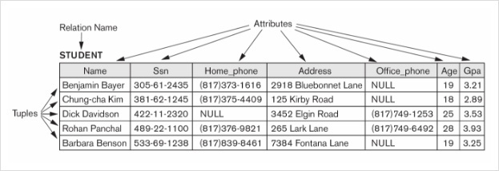

# 기본 SQL 문법법
`SQL`은 **Structured Query Language**의 준말로, 관계형 데이터베이스에서 DB의 기본 단위인 테이블을 조작하기 위한 언어이다. SQL을 사용하여 테이블을 생성하거나, 삭제할 수 있다. 또한 테이블 내의 데이터를 조회, 생성, 삭제, 수정할 수 있고, 서로 관계있는 테이블을 `Join`하여 조회할 수 있다. 이 외에도 프로그래밍 언어처럼 사용할 수 있도록 조건문, 반복문 등의 기능들이 제공된다. 

## 테이블의 구조

위 테이블은 이름이 `STUDENT`이다. 사진에선 Relation Name이라고 적혀있는데, 이는 관계형 모델 이론에서 사용하는 단어다. 의미하는 바는 테이블과 동일하다. 
테이블은 **행**과 **열**로 이루어져 있다. **행** 은 실질적인 데이터를 나타내고, Tuple, 기수, 대응수, 로우, 레코드 등 여러 이름이 있다. **열**은 데이터들의 이름이다. 컬럼, 필드, 속성(attribute) 등으로 표현되며, 속성의 수는 Degree, 차수 등으로 표현된다.
|한글|영어|약자|설명|
|---|----|----|----|
|행 |row, record||테이블의 가로 부분. 실질적인 데이터를 의미한다.|
|열 |column, field||테이블의 세로 부분|
|열 이름|column name||열을 구분하기 위한 정보|
|데이터 형식|data type||열에 저장할 데이터의 형식|
|기본 키|Primary Key|PK|각 행(row, record)를 구분할 수 있는 유일한 정보, 열|

하나의 테이블은 반드시 `기본 키 PK`가 있어야한다. `키(Key)`에도 여러 종류가 있고 이를 통해 테이블간의 관계를 맺어줄 수 있다. 여기선 다루지 않겠다.

## 기본 쿼리문
기본적인 쿼리문의 구조는 다음과 같다. 

> `SELECT` 열_이름 
`FROM` 테이블_이름 
`WHERE` 조건식 
`GROUP BY` 열_이름 
`HAVING` 조건식 
`ORDER BY` 열_이름 
`LIMIT` 숫자 

순서가 중요하다. 예약어의 순서를 지키지 않으면 오류가 난다. 

|예약어|설명|
|-----|----|
|`SELECT`|테이블에서 데이터를 가져올 때 사용한다. 작성한 열 이름에 해당하는 열이 추출된다.|
|`FROM`|데이터를 어떤 테이블에서 가져올지를 정한다.|
|`WHERE`|데이터를 조회할 때 조건을 지정한다.|
|`GROUP BY`|작성한 `열_이름`에 해당하는 열의 데이터를 중심으로 묶어준다.|
|`HAVING`|집계 함수, `GROUP BY`에 대해서 조건을 지정한다.|
|`ORDER BY`|특정 열을 기준으로 정렬한다.|
|`LIMIT`|조회한 데이터를 제한적으로 보여준다.|

이 때 `WHERE`와 `HAVING`은 닮은 듯 다르다. `WHERE`는 테이블 전체를 대상으로 조건을 지정하지만, `HAVING`은 집계 함수로 묶인 데이터를 대상으로 조건을 지정한다. 

