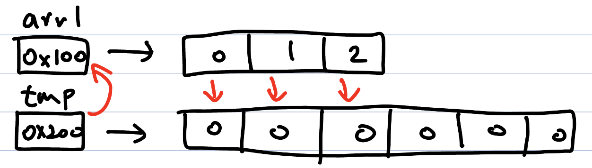

# 배열 Array
## 배열의 정의와 용도
- 동일한 타입의 데이터 10개를 생성하고 관리해야 한다고 할 때, 각각의 요소들마다 변수명을 생성하면 너무 번거롭다.
- 배열은 **동일한 타입**의 변수들의 집합이다. 이 때 변수들은 연속적인 주소로 저장된다.
> 배열은 같은 타입의 여러 변수를 하나의 묶음으로 다루는 것
>> Java의 정석, 182p

## 배열의 생성
- 배열은 `
    1. 원하는 타입의 변수를 선언하고 
    2. 배열임을 의미하는 대괄호 []를 붙여 생성한다.
    3. 대괄호는 어디 붙여도 상관 없는데 *Java의 정석*의 저자는 타입형 뒤에 붙이는게 더 적절하다고 판단한다.
- 이 때 배열을 선언하면 **참조변수를 위한 공간**이 만들어지고, 배열을 생성하면 **요소들을 저장할 수 있는 공간**이 만들어진다.
<center> 참조변수를 위한 공간</center>


</br>

<center> 배열 공간 생성 </center> 


- 예시 코드는 아래와 같다.
```
//배열의 선언
int[] arr1; //정수형 배열 arr1 선언
int arr2[]; //정수형 배열 arr2 선언

int[] arr1 = new int[5]; //길이가 5인 정수형 배열 공간 생성
int arr2 = new int[10]; //길이가 10인 정수형 배열 공간 생성

```

- **배열의 길이**는 0 이상의 정수만 가능하다.
    - **배열의 길이**는 상수이다. 생성 후 변경이 불가능하다.
- **인덱스(index)** 로 배열의 각 요소에 접근 가능하다.
    - **인덱스**란 배열의 요소마다 붙여진 일련의 번호이다.
    - **인덱스**는 0부터 시작한다! 따라서, 길이가 N인 배열에서 마지막 요소의 인덱스는 N-1이다.
- **배열의 초기화**는 타입의 초기값이다. 정수형 배열의 초기값은 0이다.
    - 즉, 변수형 배열 생성 직후 각 요소의 값은 0이다.
    - 참조형 변수의 초기(기본) 값은 `null`, 논리형 변수의 초기 값은 `false`이다.
```
int[] arr = new int[5]; // 0 0 0 0 0
arr[0] = 100; // 100 0 0 0 0
arr[2] = 10; // 100 0 10 0 0

//자바에서 배열은 이렇게도 선언 가능하다.
int[] tmp = new int[] {1,2,3,4,5}; //길이가 5이고 각 요소가 1,2,3,4,5인 배열이 생성됨
int[] tmp2 = {1,2,3,4,5}; //위와 동일하다.

```

- **배열의 길이**는 JVM이 관리한다. `length`를 사용한다.
- **배열의 출력**은 `toString()` 메소드를 사용한다.
    - 그냥 출력하면 배열 차원의 정보와 내부 주소가 나온다.
    - **참조 변수의 주소가 아니다.**
- **char형 배열**은 예외다. 출력하면 문자열처럼 나온다.
    - print 함수를 그렇게 만든거라 그냥 예외임

```
int[] arr = new int[5];
System.out.println(arr.length); // 5출력
System.out.println(arr); // I@{16진법} 출력
System.out.println(arr.toString()); //[0,0,0,0,0] 출력

char[] tmp = new char[]{H,e,l,l,o};
System.out.print(tmp); //Hello 출력
```

## 배열 복사하기
- for문을 통한 복사와 `System.arraycopy()`를 통한 복사 두 가지가 있다.
- 보통 복사를 할 땐 기존 배열보다 길이를 2배 늘려서 생성한 뒤 복사된 배열에 값을 재할당한다.
### for문을 통한 복사
- 참조변수 `arr1`이 가리키던 배열 주소가 새로 생성된 `tmp`의 배열 주소로 변경되므로, `arr1`과 `tmp`는 같은 배열의 주소를 참조하고 있다.
- `arr1`을 통해 배열을 조작하나 `tmp`를 통해 조작하나 동일 배열에 접근할 수 있다는 뜻이다.
- 이 때 `arr1`이 참조하는 배열은 기존 배열의 길이보다 2배 긴 배열이다.
```
int[] arr1 = new int[3];
for(int i = 0; i<3; i++){
    arr1[i] = i; // 0 1 2
}

int[] tmp = new int[6];
for(int i = 0; i<arr1.length; i++){
    tmp[i] = arr1[i];
}

// 새로 생성된 tmp 배열의 참조변수를 arr1에 저장한다.
arr1 = tmp; 
```
<center> 참조변수 주소, 배열 값 복사 </center>



<center> 최종 상태 </center>


## System.arraycopy()를 통한 복사
- `new_arr`배열의 0번 배열부터 `arr`의 0번 배열부터 `arr.length`개 복사한다는 뜻이다.
```
int[] arr = new int[3];
for(int i = 0; i<3; i++){
    arr[i] = i; // 0 1 2
}

int[] new_arr = new int[6];
System.arraycopy(arr, 0, new_arr, 0, arr.length);

//new_arr : 0 1 2 0 0 0
```
- `new_arr`배열의 1번 배열부터 `arr`의 0번 배열부터 `arr.length`길이만큼 복사한다는 뜻이다.
```
int[] arr = new int[3];
for(int i = 0; i<3; i++){
    arr[i] = i; // 0 1 2
}

int[] new_arr = new int[6];
System.arraycopy(arr, 0, new_arr, 1, arr.length);

//new_arr 0 0 1 2 0 0
```