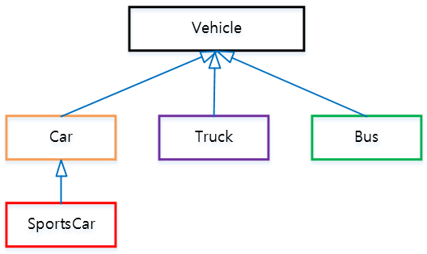

# 상속 (Inheritance)
상속은 기존의 클래스를 새로운 클래스에 확장시키는 것을 의미한다. 확장이라는 용어를 쓴 이유는, 클래스를 상속시킬 때 `extends`라는 키워드를 사용하기 때문이다.</br>
만약 새로 작성하려는 클래스의 이름이 `Child`이고 상속받고자 하는 클래스의 이름이 `Parent`라면, 다음과 같이 쓸 수 있다.
```
class Parent{
    String home;
    int age;
}
```
```
class Child extends Parent{
    int age;
    void play() {}
}
```
이 때 `Parent` 클래스의 멤버 변수는 `home`과 `age`가 있고, `Child` 클래스의 멤버 변수는 `age`, `play()`와 `Parent`로부터 상속받은 `home`과 `age`가 있다.</br>
이 때 `Parent` 클래스가 가지고 있는 `age`와 `Child` 클래스가 가지고 있는 `age`의 이름이 일치한다. 이 때 기본적으로 `Child`가 가지고 있는 `age`를 의미하되, `Parent`가 가지고 있는 `age`를 사용하려면 `super`을 사용하면 된다. 이는 생성자 파트에서 짧게 다뤘다.</br>

이 때, 생성자와 초기화 블록은 상속되지 않는다. 그리고 상속의 특성상 자손 클래스의 멤버 개수는 조상 클래스보다 항상 같거나 더 많다.

1. **조상 클래스** 부모(parent) 클래스, 상위(super) 클래스, 기반(base) 클래스
2. **자손 클래스** 자식(child) 클래스, 하위(sub) 클래스, 파생(derived) 클래스

**코드를 확장**시키면 다음과 같은 **이점**이 있다.

1. **코드의 중복**을 줄일 수 있다.
2. **코드 변경 사항 반영**을 빠르게 할 수 있다.

## 2. 상속 계층도
클래스간의 상속 관계를 보여주는 그래프다. 예를 들면 아래와 같다. [출처는 여기](https://codedragon.tistory.com/5361)입니다.



위 상속 계층도는 다음과 같이 말할 수 있다.
-  `Vehicle` 클래스는 모든 클래스들의 가장 상위 클래스이다. 
- `Vehicle`은 `Car`, `Truck`, `Bus` 클래스에게 상속해준다.
- `Car`는 `Vehicle`을 상속 받는다.
- `SportsCar` 는 `Vehicle`과 간접 상속 관계이다.
- `Vehicle`은 `SportsCar`의 간접 조상이다.

`Vehicle`과 `Car`, `SportsCar`를 코드로 구현하면 아래와 같다.
```
class Vehicle { }
class Car extends Vehicle { }
class SportsCar extends Car { }
```

## 3. 상속 말고 포함관계
클래스를 재사용 하는 방법에는 상속만 있는게 아니다. 클래스 간의 **포함(Compostie) 관계**를 맺어줄 수 있다. 포함 관계는 하나의 클래스를 작성할 때 **다른 클래스를 멤버 변수**로 선언하여 표현할 수 있다.</br>
코드로 예시를 들면 아래와 같다.
```
class Car {
    //클래스 인스턴스를 멤버 변수로 가지고 있다.
    Engine e = new Engine(); 
    Door[] d = new Door[4];
    ...
}
```

그럼 클래스 구조를 설계할 때, **상속(Inheritance)** 으로 묶을 것인지, **포함(Composite)** 로 묶을 것인지 고민될 것이다. 이는 맥락에 따라 결정하면 된다.</br>

|예시|관계|
|----|---|
|**차(Car)** 는 **엔진(Engine)** 을 가지고 있다.|포함 관계|
|**스포츠카(SportsCar)** 는 **차(Car)** 이다|상속 관계|
|**유튜브(Youtube)** 는 **영상(Video)** 을 가지고 있다|포함 관계|
|**자식(Child)** 은 **사람(Man)** 이다|상속 관계|
</br>

## 4. 단일 상속 vs 다중 상속
Java는 기본적으로 단일 상속을 원칙으로 한다. C같은 경우 다중 상속을 허용하고, 이에 따른 장점을 취할 수 있다.</br>
하지만 다중 상속을 사용할 때에 비해 단일 상속을 사용할 때 클래스 간의 관계가 더 **명확**해지고, 코드를 더욱 **신뢰**할 수 있게 해준다는 장점이 있다.

## 5. 모든 클래스의 공통 조상 : Object 클래스
`Object`는 모든 클래스의 공통 조상, 최상단 조상이다. 위의 예시에서 가장 근본이 되는 조상은 `Vehicle`이다. 사용자가 명시하진 않았지만, 컴파일러는 다음과 같이 인식한다.
```
class Vehicle extends Object { }
```
`Object` 클래스에는 `equals()`나 `toString()` 등의 메서드가 정의되어 있다. 총 11가지의 기본 메서드가 정의되어있다.</br></br>

# 다형성 
상속과 깊은 관련이 있는 개념으로, 사실 상속을 실용적으로 활용할 수 있는 가이드라인이라고 보면 될 듯 싶다.</br>
아래는 다형성에 대한 정의로, 다 같은 말이다.</br>
**여러 가지 형태를 가질 수 있는 능력**</br>
**한 타입의 참조 변수로 여러 타입의 객체를 참조할 수 있다**</br>
**조상 클래스 타입의 참조 변수로 자손 클래스의 인스턴스를 참조할 수 있다.**</br>

예를 들면 다음과 같다. 아래와 같이 상속 관계가 형성되어 있을 때, `Tv` 클래스는 `CaptionTv` 클래스의 조상 클래스다. 위 다형성의 정의에 따르면, `Tv` 클래스 타입의 참조 변수로 `CaptionTv` 클래스의 인스턴스를 참조할 수 있다.
```
class Tv{
    boolean power;
    int channel;

    void power() { }
    void channelUp() { }
    void channelDown() { }
}

class CaptionTv{
    String text;
    void caption() { }
}
```
참조의 예시는 아래와 같다. 지금까지 `Tv` 타입의 참조 변수는 `Tv` 타입의 인스터를 참조했다. 하지만 아래는 `Tv` 타입의 참조 변수가 `CatpionTv` 타입의 인스턴스를 참조하고 있다. 이것은 `Tv` 클래스가 `CaptionTv` 클래스의 조상 클래스이기 때문에 가능하다.
```
Tv t = new CatpionTv();
```
단, 이 때 주의해야 할 점이 있는데, `Tv` 클래스는 `CaptionTv` 클래스의 멤버 변수 중 일부만, 즉 `Tv` 클래스가 상속해준 멤버 변수만 사용할 수 있다. 이는 아래 예시로 더 확실하게 확인할 수 있다.
```
CaptionTv c = new CaptionTv();
Tv        t = new CaptionTv();
```
이 때 `c`는 `CaptionTv` 클래스의 모든 메서드, 멤버 변수를 사용할 수 있지만, `t`는 `text` 변수와 `caption()` 메서드는 사용할 수 없다.</br>

반대로 **자손 클래스 타입의 참조 변수**가 **조상 클래스 인스턴스를 참조**할 수 있을까? 불가능하다.
```
CaptionTv c = new Tv(); // 컴파일부터 안된다.
```
이는 `CaptionTv` 타입의 `c` 참조 변수가 `Tv` 타입의 인스턴스보다 더 많은 멤버 변수를 포함하고 있기 때문이다. 왜 안되게 설정해뒀냐면.. 인스턴스한테 없는게 참조변수한테 있으면 접근이 불가능한-생성 자체가 안된- 멤버 변수나 메서드에 접근하려고 할 수 있기 때문이다.
</br>
</br>
## 다형성의 형변환
서로 상속 관계에 있는 클래스들끼리는 서로 형변환이 가능하다. 아래는 **참조 변수의 자동 형변환**의 형변환 생략 가능 조건이다.</br>

|상황|가능 여부|
|----|--------|
|자손 타입 -> 조상 타입 (Up-casting)| 형변환 생략 가능
|조상 타입 -> 자손 타입 (Down-casting)| 형변환 생략 불가능|

형 변환을 할 때는 캐스트 연산자를 사용하여, 괄호 안에 반환하고자 하는 타입을 적어주면 된다.
```
Tv t; // 조상 타입 참조변수
CaptionTv c; // 자손 타입 참조변수
CatpionTv c2;

c = (CaptionTv)t; // 조상 -> 자손 : 생략 불가능
t = c2; // 자손 -> 조상 : 생략 가능
```

자손 타입의 참조 변수를 조상 타입 참조 변수로 형변환 할 때는, **참조변수가 다룰 수 있는 멤버의 개수**가 실제 **인스턴스가 가지고 있는 멤버의 개수**보다 더 적을 것이다. 따라서 형변환을 생략해도 문제가 없다.</br>
여기서 주의해야 할 점은, **형변환**은 **참조 변수의 타입을 변환**하는 것이지 인스턴스를 형변환 하는 것이 아니다.
</br>
다음의 세 가지 문구를 잘 기억하자.

1. 조상 타입의 인스턴스는 자손 타입의 참조 변수로 참조할 수 없다.
```
CaptionTv c = new Tv(); // 불가능
```
2. 자손 타입의 인스턴스는 조상 타입의 참조 변수로 참조할 수 있다.
```
Tv t = new CaptionTv(); // 가능
```
3. 조상 타입의 참조 변수는 자손 타입의 참조 변수와 형변환이 가능하다.
```
Tv t; // 조상 타입 참조변수
CaptionTv c; // 자손 타입 참조변수
CatpionTv c2;

c = (CaptionTv)t;
t = c2;
```
</br>
 다음의 경우는 불가능하다.
 
 ```
Tv t1 = new Tv();
Tv t2 = null;
CaptionTv c1 = null;

c1 = (CaptionTv)t1;
 ```
 왜 불가능할까? `t1` 참조 변수는 `CaptionTv` 클래스의 조상이므로, 형변환 연산자를 통해 제대로 형변환을 해줬다. 하지만, 1번 규칙에 위배된다. `Tv` 타입의 `t1` 참조 변수는 이미 `Tv` 타입의 인스턴스를 참조하고 있다.</br>
 만약 `Tv t1 = new Tv();`가 아니라 `Tv t1 = new CaptionTv()`였다면 형변환이 가능했을 것이다. `t1`이 `CaptionTv` 타입의 인스턴스를 참조하고 있기 때문이다.</br>

 ## instanceof 연산자
형변환이 가능한지 여부를 간단하게 확인할 수 있는 방법이 있다. `instanceof` 연산자를 사용하면 된다. 해당 연산자의 왼쪽에는 참조 변수를, 오른쪽에는 타입을 적는다. 이 연산자는 참조변수가 오른쪽 타입으로 형변환이 가능한지 여부를 검사하여, `true`, `false` 형태로 반환한다. </br>
```
// 가능한 경우
// 조상 참조 변수는 자손 인스턴스 참조 가능
void doChange(Tv t){
    if(t instancof CaptionTv){
        CaptionTv c = (CaptionTv)t;
    }
}
```
```
// 불가능한 경우
// 자손 참조 변수는 조상 인스턴스 참조 불가능
void doChange(CaptionTv c){
    if(c instancof Tv){
        Tv t = (Tv)c;
    }
}
```
참고로 간접 조상도 모두 동일하게 적용되고, `Object`는 모든 클래스의 조상이므로 다음과 같은 경우도 가능하다.
```
CaptionTv c = new CaptionTv();

if(c instanceof CaptionTv){
    System.out.println("CaptionTv Instance");
}

if(c instanceof Tv){
    System.out.println("Tv Instance");
}

if(c instanceof Object){
    System.out.println("Object Instance");
}

System.out.println(c.getClass().getName());
```
```
CaptionTv Instance
Tv Instance
Object Instance
CaptionTv
```
`CaptionTv`는 `Tv`의 자손이고, `Tv`는 `Object`의 자손이기 때문에, 자손 인스턴스를 참조하고 있는 자손 참조변수는 조상 참조 변수로 변환 시킬 수 있음을 의미한다. 만약 `Tv t = new CaptionTv();` 였으면 결과가 달랐을 것이다.
</br></br>

 ## 참조변수와 인스턴스의 연결
만약 `조상 클래스`에서 선언된 멤버 변수와 `자손 클래스`에서 선언된 멤버 변수의 이름이 중복된다고 해보자. 이 때 어떤 타입의 참조 변수로 자손 인스턴스를 참조하는지에 따라서 다른 결과 값을 얻는다.</br>

**CASE 1** 조상 타입의 참조 변수를 사용 할 경우 `조상 클래스의 멤버 변수`가 사용된다. </br>

**CASE 2** 자손 타입의 참조 변수를 사용할 경우, `자손 클래스의 멤버 변수`가 사용된다.</br>

아래 예시 코드를 보면, `age` 멤버 변수가 `greet()` 메서드의 이름이 중복되어 있다.
```
class Parent{
    int age = 40;
    void greet(){
        System.out.println("부모입니다.");
    }
}

class Child{
    int age = 10;
    void greet(){
        System.out.println("자식입니다.");
    }
}
```
이 때 자손 타입의 참조 변수로 `Child` 인스턴스를 참조하는지, 조상 타입의 참조 변수로 참조하는지에 따라 다른 변수를 호출한다.
 ```
 Child c = new Child();
 Parent p = new Child();

 c.age; // 10
 c.greet(); // 자식입니다.

 p.age; // 30
 p.greet(); // 부모입니다.
 ```

 물론 다음과 같이 이름이 중복되지 않을 경우, 조상으로부터 상속받은 멤버 변수가 호출된다.
 ```
 class Parent{
    int age = 40;
    void greet(){
        System.out.println("안녕하세요.");
    }
}

class Child{
    int age = 10;
}
 ```
```
Child c = new Child();
 Parent p = new Child();

 c.age; // 10
 c.greet(); // 안녕하세요.

 p.age; // 30
 p.greet(); // 안녕하세요.
```
</br></br>
## 매개변수의 다형성
앞서 조상 타입의 참조 변수는 자손 타입의 참조 변수들로 형변환이 가능하고, 자손 타입의 인스턴스도 참조가 가능하다고 했다. 이는 매개 변수에서도 동일하게 적용되는데, 이 성질을 이용하면 작성해야 하는 **메서드를 줄일 수 있다.**</br>

아래 예시 코드를 보자. `Buyer` 클래스는 `Buy()`메소드가 있는데, 이를 클래스 타입별로 하나씩 만들어 오버로딩 되었다. 매개 변수의 타입이 다르기 때문에 오버로딩 시킬 수 있다.</br>
하지만 `Product` 클래스는 `Tv`, `Computer`, `Auido` 클래스의 조상이기 때문에, `Product` 타입의 참조 변수는 `Tv`, `Computer`, `Auido` 타입의 참조변수와 함께 사용 가능하다. 즉,
```
class Product{
    int price;
    int bonusPoint;
}

class Tv extends Prodcut { }
class Computer extends Prodcut { }
class Audio extends Prodcut { }
```
```
class Buyer{
    int money = 1000;
    int bonusPoint = 0;

    void Buy(Tv t){
        money = money - t.price;
        bonusPoint = bonusPoint + t.bonusPoint;
    }

    void Buy(Computer c){
        money = money - c.price;
        bonusPoint = bonusPoint + c.bonusPoint;
    }

    void Buy(Audio a){
        money = money - a.price;
        bonusPoint = bonusPoint + a.bonusPoint;
    }
}
```
아래와 같이 변경될 수 있다는 뜻이다. 
```
class Buyer{
    int money = 1000;
    int bonusPoint = 0;

    void Buy(Product p){
        money = money - p.price;
        bonusPoint = bonusPoint + p.bonusPoint;
    }
}
```

</br>

**배열**의 경우도 마찬가지다. `Product` 타입의 배열을 선언하면, `Product`를 조상으로 가지고 있는 자손 타입의 인스턴스들을 참조시킬 수 있다. 아래가 그 예시이다.
```
Product[] p = new Product[3];

p[0] = new Tv();
p[1] = new Computer();
p[2] = new Audio();
```