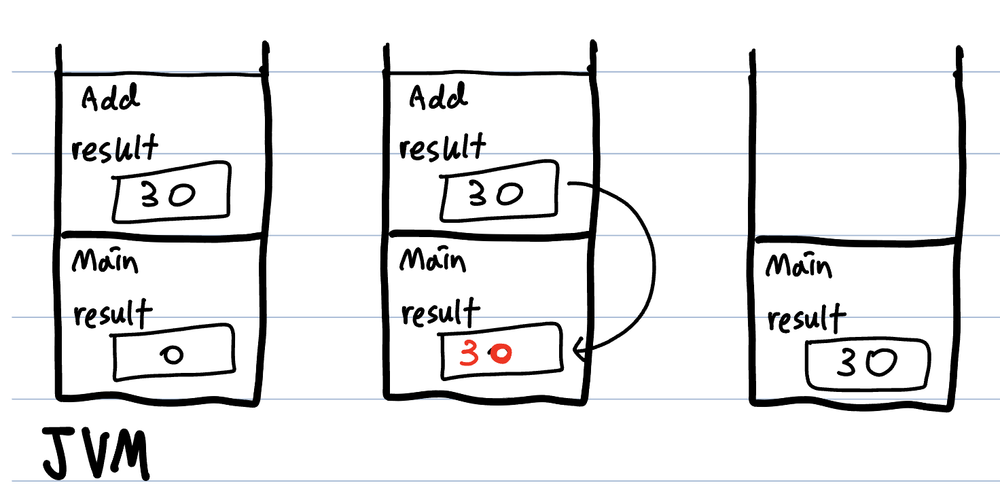

# 클래스와 객체
객체지향적 관점에서 클래스는 **객체를 생성하기 위한 템플릿**이지만 프로그래밍 관점에서 클래스는 **데이터와 함수의 결합**이다.</br>
전산학에서는 데이터를 좀 더 효율적으로 처리하기 위해
> 변수 : 하나의 데이터를 저장하는 공간</br>
배열 : 같은 종류의 여러 데이터의 집합</br>
구조체 : 서로 관련되고 다양한 데이터 형태의 집합</br>
클래스 : 구조체 + 함수(메서드, 행위)</br>

순으로 발전했다. **String**은 `char`배열을 다루는 문자열 클래스다.</br>
언어에서 제공하는 기본 자료형(primitive type)으 제외하고 사용자가 필요에 의해 생성한 자료형을 **사용자 정의 타입(user-defined type)** 이라고 한다. class는 사용자 정의 타입 변수이다.

학생 클래스를 정의하고, 이를 인스턴스화 시킨 객체를 선언할 때 메모리에는 다음과 같은 현상이 발생한다.

```
class Student{
    String name; //멤버 변수
    int age; //멤버 변수
    float height; //멤버 변수
    
    void study(){ //공부를 하는 행위 } //메서드
}
```

```
class example{
    Student extra_student; // 1
    extra_student = new Student(); // 2
    extra_student.name = "Kim";
    extra_student.age = 27;
    extra_student.height = 180.8; // 3

    extra_student.stduy();
}
```


객체를 `new` 연산자로 생성하면, 객체의 이름에는 객체의 정보가 저장된 **주소**가 저장된다. 이는 앞서 학습했던 **String**이나 **배열**과 같다. 즉, Primitive type 변수가 아니라 Reference type 변수란 뜻이다.</br>
이런 점에서 착안할 때, 여러 학생들을 관리하기 위해 배열을 선언하면 메모리에는 다음과 같이 현상이 발생한다.
```
class example{
    Studnet[] group = new Student[3]; // 1
    group[0] = new Student();
    group[1] = new Student();
    group[2] = new Student(); // 2

}
```


**String 배열**이나 **다차원 배열**과 다르지 않다.</br>

# 변수와 메서드
인스턴스(생성된 객체)의 멤버 변수에 접근하여 값을 저장할 때, 제약을 주고 싶을 때가 있다. 위 코드르 예로 들면 `age`변수는 `14~19`까지라고 해보자. 이 때 멤버 변수에 값을 저장하는 메서드를 생성하고, 메서드 내부에 제약 조건을 설정하면 원하는 기능을 구현할 수 있다.</br>

## 클래스 변수, 인스턴스 변수, 지역 변수
변수에는 **변수가 선언된 위치**에 따라 세 종류가 있다.
1. 메서드 내부에 선언된다. 멤버 변수가 아니면 지역 변수다.
2. 멤버 변수 중 `static`이 붙으면 클래스 변수다.
2. 멤버 변수 중 `static`이 없으면 인스턴스 변수다.
```
class Var{
    int instance_var; //인스턴스 변수
    static int class_var; //클래스 변수
    void method(){
        int local_var; //지역 변수
    }
}
```
이 때 각 변수들이 생성되고, 소멸되는 주기를 알아둘 필요가 있다.
|변수 이름|생성 시기|소멸 시기|
|---------|-------|---------|
|클래스 변수</br>(class variable)|클래스가 메모리에 올라갈 때</br>(클래스가 Loading 될 때)|프로그램이 종료될 때|
|인스턴스 변수</br>(instance variable)|인스턴스가 생성될 때|인스턴스가 소멸할 때|
|지역 변수</br>(local variable)|메서드 내에서 선언될 때|메서드가 끝날 때, 반복문 등에서 블록`{}`을 벗어날 때|

소멸 시기가 중요한 이유는 클래스 변수의 특성 때문이다.</br>
**인스턴스 변수**는 인스턴스(객체)가 생성될 때마다 생성되어 독립정인 메모리를 확보한다. 하지만 **클래스 변수**는 클래스가 메모리에 올라갈 때 메모리 공간을 확보한다. 즉, `static`으로 선언된 **클래스 변수**는 모든 인스턴스에서 동일한 값을 가지고 있으며, 인스턴스를 생성하지도 않아도 접근하거나 활용할 수 있다.</br>
이는 변수 뿐만 아니라 **메서드도 마찬가지**다.

## 메서드
></br>메서드는 특정 작업을 수행하는 일련의 문장들을 하나로 묶은 것이다.</br></br>

쉽게 말해 파이썬의 `def`, 자바스크립트의 함수와 같은 역할이다. 좁게는 기능별로, 넓게는 동작별로 구성시킬 수 있다.</br>
메서드를 사용하면 다음의 세 가지 이점을 얻을 수 있다.
1. 높은 재사용성(reusability)
2. 중복된 코드의 제거
3. 프로그램의 구조화

만약 당신이 주어진 수식을 `퓨리에 변환`해야 하거나, 수 백개의 무작위로 선언된 배열을 `정렬(sort)` 해야 한다고 해보자. 이를 `main` 파일에서 수식이 등장할 때마다, 배열이 주어질 때마다 일련의 코드들을 등장시키면 코드가 굉장히 지저분해지고, 반복적이다. 만약 일련의 동작을 수행하고 반환하는 코드를 묶어 관리할 수 있다면, 메서드는 **자주 사용될 것**이고 **코드 중복이 줄어들 것**이며 프로그램이 실행되는 영역에서는 **동작별로 프로그램을 구조화** 시킬 수 있을 것이다.</br>

**메서드**는 **선언부**와 **구현부**로 나뉜다. 선언부는 `반환 타입 - 메서드 이름 - (인자 입력)`으로 나뉜다. 구현부는 `호출 시 동작할 코드 - 값 반환(return)`으로 구성된다. 예시는 아래와 같다.
```
int add(int x, int y){ // 타입 - 이름 - 인자
    int result = x + y; // 호출 시 동작할 코드
    return result; // 값 반환
}
```
- **반환 타입**은 `return` 앞의 객체와 타입이 일치해야 한다. `void`인 경우 반환 타입이 없다는 뜻으로, `return`을 생략하거나 `return`만 적을 수 있다.
- **메서드 이름**은 기능을 직관적으로 이해할 수 있어야 한다.
</br>

## 경우의 수 따져보기
헷갈릴 수 있는 경우가 많아 모아서 정리해봤다. 시나리오 별 무엇이 입력되고, 반환되는지 생각해보자.</br>
`참조형 매개변수 - 기본형 매개 변수`는 해당 3번 경우로 설명이 가능해서 포함하지 않았다.

1. 기본형 매개 변수가 입력되고, 기본형 매개 변수가 반환될 때
2. 기본형 매개 변수가 입력되고, 참조형 매개 변수가 반환될 때
3. 참조형 매개 변수가 입력되고, 참조형 매개 변수가 반환될 때
4. 인스턴스 멤버는 클래스 멤버 변수를 참조할 수 있는가?
5. 클래스 멤버 변수는 인스턴스 멤버 변수를 참조할 수 있는가?

### 1. 기본형 매개 변수 - 기본형 매개 변수
```
class main{
    int result = add(10, 20);
}
```
```
int add(int x, int y){
    int result = x + y;
    return result;
}
```

위의 경우, 10과 20이라는 정수 기본형 매개 변수가 입력되고 반환되는 result도 정수형 매개 변수다. `main`에서 `result`는 `add`의 `result`와는 독립적인 변수이며, 값 자체를 반환받아 저장한다.



</br>

### 2. 기본형 매개 변수 - 참조형 매개 변수

```
class main{
    String result = add(10, 20);
}
```
```
String add(int x, int y){
    String result = String.valueOf(x + y);
    return result;
}
```
이 경우 10과 20은 정수로 기본형 매개변수이지만, 반환 값을 `String`으로 참조형 매개변수이다. 참조형 매개변수는 `"30"`을 반환하지 않는다. 대신 `"30"`을 데이터를 저장하고 있는 주소값을 반환한다. `main`에 있는 `result` 변수에도 `"30"`이 저장된 주소값을 저장한다.

</br>

### 3. 참조형 매개 변수 - 참조형 매개 변수

```
class main{
    String tmp1 = new String("Hello ");
    String tmp2 = "World"
    String result = add(tmp1, tmp2);
}
```
```
String add(String x, String y){
    String result = x+y;
    return result;
}
```
`add` 메서드에서 입력받는 두 인자는 `"Hello "`와 `"World"`가 아니다. 두 데이터를 저장하고 있는 주소를 입력받는다. 반환하는 것은 2번 경우와 동일하다.</br>

이처럼 참조형 매개 변수를 인자로 입력받는 경우 특이한 점이 있다. 바로 주소 값을 가지고 있으므로, `add` 메서드에서 값을 조작할 경우 `main` 메서드에서의 `tmp1`과 `tmp2`의 값도 변경되는 것이다.</br>

이는 기본형 매개 변수 - 기본형 매개 변수 케이스와 다른 점이다. 기본형 매개 변수가 인자로 입력되어 메서드로 넘어갈 때는 값이 복사되어 넘어가지, 해당 값이 저장되어있는 주소 값이 전달되지 않는다. 따라서 조작이 불가능하다.


</br>

### 4. 인스턴스 멤버 변수가 클래스 멤버 변수를 참조
클래스(static) 멤버 변수는 클래스가 Loading될 때 생성된다고 했다. 따라서 인스턴스 멤버 변수보다 먼저 생성된다. 즉, 인스턴스 멤버 변수는 클래스 멤버 변수는 참조할 수 있다.

</br>

### 5. 클래스 멤버 변수가 인스턴스 멤버 변수를 참조
그러나 인스턴스 멤버 변수는 클래스 멤버 변수보다 나중에 생성된다. 이는 클래스 멤버 변수는 컴파일 되는 시점에서 생성되는 것과 다르게, 인스턴스 멤버 변수는 객체가 인스턴스화 될 때 생성되기 때문이다. 따라서 클래스 멤버 변수가 인스턴스 멤버 변수를 참조하는 것은 **불가능하다**.

</br>

## 클래스 메서드, 인스턴스 메서드
변수에 대해 설명할때와 마찬가지로, 메서드도 `static`이 붙은 클래스 메서드와 인스턴스 생성 후에만 사용될 수 있는 인스턴스 메서드 두 종류가 있다.</br>
**인스턴스 메서드**는 메서드 수행을 위해 인스턴스 변수를 필요로 한다.</br>
**클래스 메서드**는 메서드 수행을 위해 인스턴스 변수가 필요 없다.

>1. 클래스 설계 시 멤버 변수 중 모든 인스턴스에 공통적으로 사용되는 것에 `static`을 붙인다
>2. 메서드 내에서 인스턴스 변수를 사용하지 않는다면, `static`을 붙이는 것을 고려한다.
></br>JAVA의 정석 278p

예를 들면 `Math` 클래스나, `System` 클래스가 있다.
```
class main{
    int result = Math.random()*10;
    System.out.println(result);
}
```
두 메서드 모두 `Math` 인스터스를 생성하거나, `System`인스턴스를 생성하지 않았는데도 불구하고 사용할 수 있다.

</br>

## 메서드 호출 시 메모리 동작 순서

[JVM 메모리 구조](./%EC%9E%90%EB%B0%94%20%EA%B0%80%EC%83%81%20%EB%A8%B8%EC%8B%A0(JVM).md) 참고하자.</br>
```
class Test{
    public static void main main(String[] args){
        methodOne();
        System.out.println("main");
    }
    static void methodOne(){
        methodTwo();
        System.out.println("Method One");
    }
    static void methodTwo(){
        System.out.println("Method Two");
    }
}
```
의 실행 결과는 다음과 같다.
```
Method Two
Method One
main
```

동작 순서는 다음과 같다.</br>

1. `main`이 실행되고, `main`은 `호출 스택`에 쌓인다.
2. `main`의 코드를 읽던 중 `methodOne` 메서드가 실행된다.
3. `methodOne` 메서드가 호출 스택에 쌓인다.
4. `methodOne` 코드를 실행하던 도중, `methodTwo` 메서드가 실행된다.
5. 호출 스택에 올라가고, `methodTwo` 코드가 실행되어 "Method Two"가 출력된다.
6. 호출 스택에 있던 `methodTwo`가 사라지고 `methodOne`의 다음 코드가 실행되어, "Method One"이 출력된다.
7. 호출 스택에 있던 `method One`이 사라지고, `main`의 다음 코드인 "main"이 출력된다.