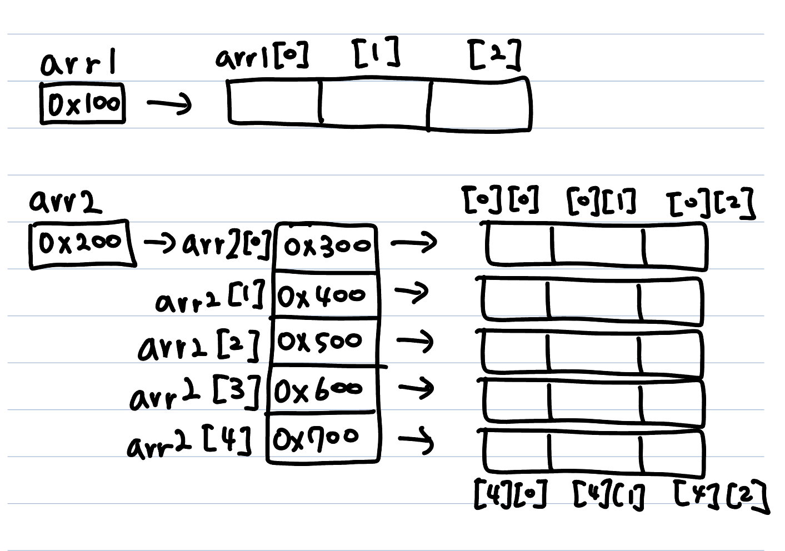
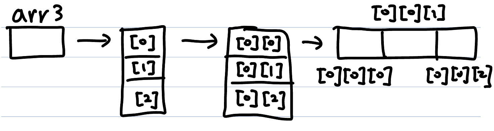
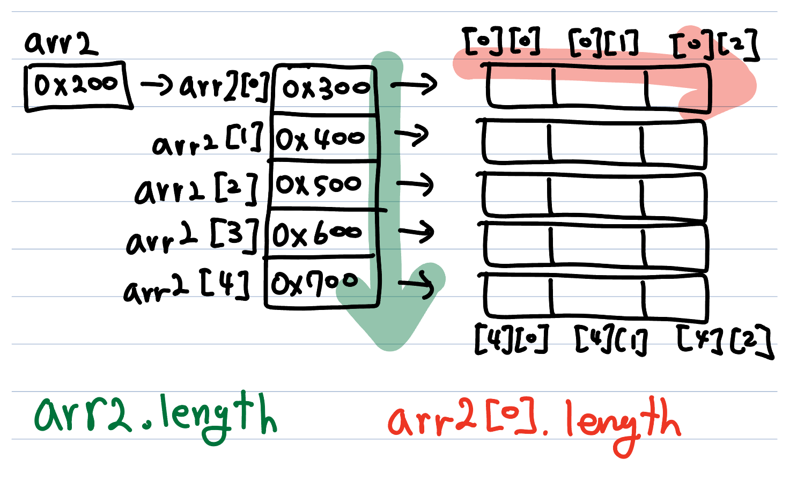
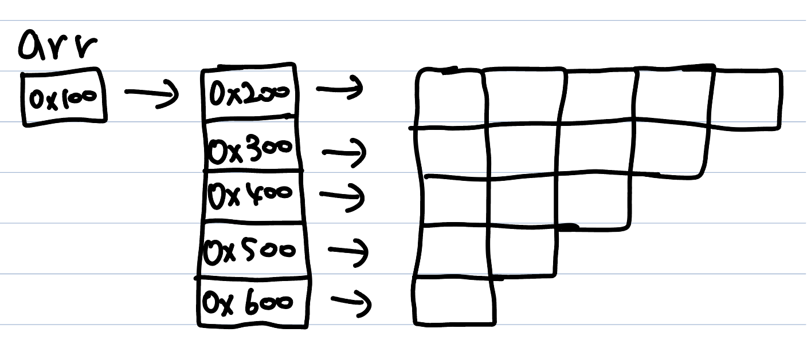

# 다차원 배열
다차원 배열은 1차원 배열이 확장된 거라고 보면 된다. N차원 배열은 괄호의 쌍을 늘려주면 된다. 배열의 길이는 임의로 지정했다.</br>
2차원 배열에서는 행, 열 순으로 선언한다. 따라서 세로 길이가 5이고 가로 길이가 3인 2차원 배열을 선언하려면 `arr2`처럼 선언하면 된다.
```
//1차원 배열
int[] arr1 = new int[3];

//2차원 배열
int[][] arr2 = new int[5][3];

//3차원 배열
int[][][] arr3 = new int[3][3][3];
```
이름 그림으로 표현하면 다음과 같다.



3차원 배열은 지면 관계상 [0][0] 까지만 표현했다.



기본적으로 일차원 배열과 동일하지만 주의해야 할 점이 몇가지 있다.
```
int[] arr2 = new int[5][3];
arr2.length; // 5
arr2[0].length; // 3
```
이는 다차원 배열은 일차원 배열의 배열이기 때문이다. 말이 어려울 수 있는데, 배열 속의 배열이라고 생각하면 된다. `int[]`형 배열이므로 `int[][]`인 셈이다. 헷갈리면 참조형 타입 배열을 생각해보자.



# 가변 배열
다차원 배열을 설명할 때 "배열 속의 배열"이라는 표현을 썼다. 이 때 배열을 담는 배열은 배열이라고 하고, 배열에 담기는 배열을 요소라고 해보자. 이 때 요소의 길이는 고정되어있지 않다. 다음과 같은 선언이 가능하다는 뜻이다.
```
//행만 선언하고 열의 길이는 선언하지 않았다.
int[][] arr = new int[5][];
arr[0] = new int[5]
arr[1] = new int[4]
arr[2] = new int[3]
arr[3] = new int[2]
arr[4] = new int[1]
```
이를 그림으로 표현하면 다음과 같다.

