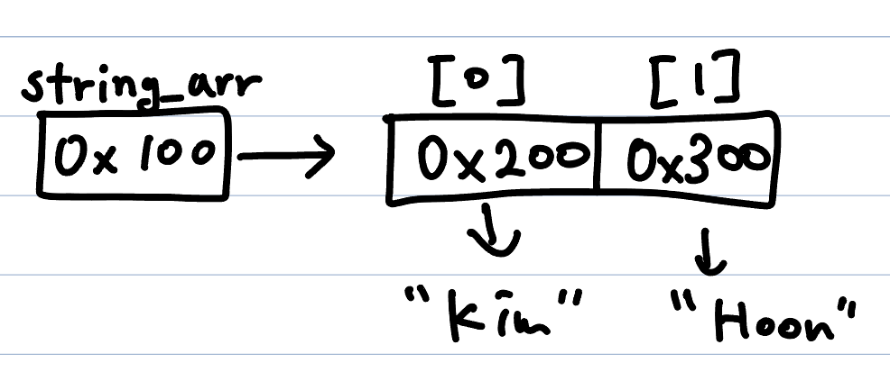

# 객체형 배열
String 배열의 생성법, 사용법은 배열과 동일하다.**타입**을 앞에 쓰고, 배열임을 선언하는 괄호를 쓰고, 변수 이름을 쓰고, 대입 연산자와 `new`로 선언할 수 있다.</br>
Java에서는 기본형 타입을 제외한 나머지는 참조를 통해 접근할 수 있다. String도 참조형이면서 익숙한 자료형이라서 예시로 들었다.</br>
사용 예시는 아래와 같다.
```
// 5개의 문자열을 담을 수 있는 배열 공간 생성
String[] string_arr = new String[5]; 

// "Kim"과 "Hoon"이라는 문자열을 담은 문자열 배열 생성
String[] string_arr2 = new String[]({"Kim", "Hoon"});

string_arr.length // 5
string_arr2.length // 2
```
한 가지 다른 점이 있는데, 그것은 배열이 저장하는 값이다. 기본형 타입은 배열의 이름 변수는 내부 주소를 저장하고, 실제 배열에는 데이터들이 저장된다. 하지만 객체형 배열에서는 데이터가 아닌 데이터를 저장하는 주소가 저장된다.



## char배열과 String 클래스
- `String`은 `char`배열에 메서드를 추가한 확장 클래스다. 그래서 기본적으로 `char`배열의 기능들을 활용할 수 있지만, 몇가지 차이점이 있다.
- `String`은 생성과 동시에 불변한다. 값이 변하는 것처럼 보여도 변하는 것이 아니고, 새롭게 생성되고 복사되는 것이다. 이 과정은 [배열복사](./array.md) 파트를 참고하자.
- `char`배열과 `String` 클래스는 상호변환 가능하다.
```
char[] tmp = {'A','B','C'};
String test_str = new String(tmp); // ABC
char[] test_char_arr = test_str.toCharArray(); // {'A', 'B', 'C'}
```
- `String`은 클래스이므로 정석적인 생성법은 `new`와 함께 생성할 때 값을 입력해주는 것이다.
- `str2`처럼 해도 된다.
```
String str = new String("I am String");
String str2 = "I am String two";
```