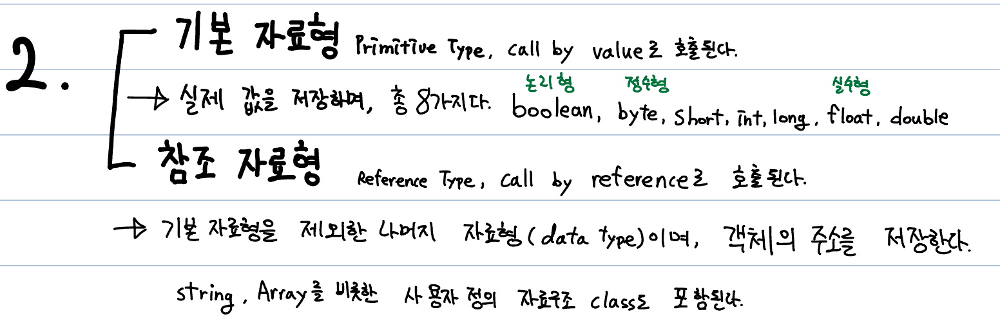

# Java에서의 변수
## 하나의 값을 저장할 수 있는 메모리 공간
- 메모리는 여러 프로그램이 공용으로 사용하는 공간이다.
- 따라서 변수를 선언하려면 이름을 지정해야 하고, 사용하려면 초기화가 필요하다.
- '데이터 값' 자체를 의미하는 것이 아니다.

## 변수의 타입
### 1. 값에 의한 분류

### 2. 저장 방식에 의한 분류

- 저장 방식에 의한 분류는 **기본 자료형(Primitive type)** 과 **참조 자료형(Reference Type)** 으로 나뉜다.
- 기본 자료형은 논리형(boolean), 정수형(byte, short, int, long), 실수형(float, double), 문자형(char)로 총 8개다. `첨부 사진엔 문자형이 빠져있다.`
- 참조 자료형은 기본 자료형 이외의 모든 자료형이다.

#### 기본 자료형
- Call by value의 특징을 가진다.
- 선언 후 메모리에 값이 저장된다.
- 자료형의 종류와 크기는 외워야한다.
    - 1 byte : 논리형(boolean), 정수형(byte)
    - 2 byte : 문자형(char), 정수형(short)
    - 4 byte : 실수형(float), 정수형(int)
    - 8 byte : 실수형(double), 정수형(long)
- `int는 CPU가 효율적으로 다룰 수 있는 단위로, 주로 사용된다.` byte, short의 경우 메모리를 아껴야 할 때 사용된다.
- 실수형은 소수점을 표현할 수 있다.
#### 참조 자료형
- Calle by reference의 특징을 가진다.
- 선언 후 메모리에 주소가 저장된다.
- 주소를 따라가면 데이터의 값을 볼 수 있다.

## 용어
- **상수** : 변하지 않도록 고정된 값이다. constant라고도 하며, 변수형 앞에 final을 붙여 선언할 수 있다.
- **리터럴** : 데이터 값 그 자체를 의미한다.수학에서 상수의 의미를 갖는다.