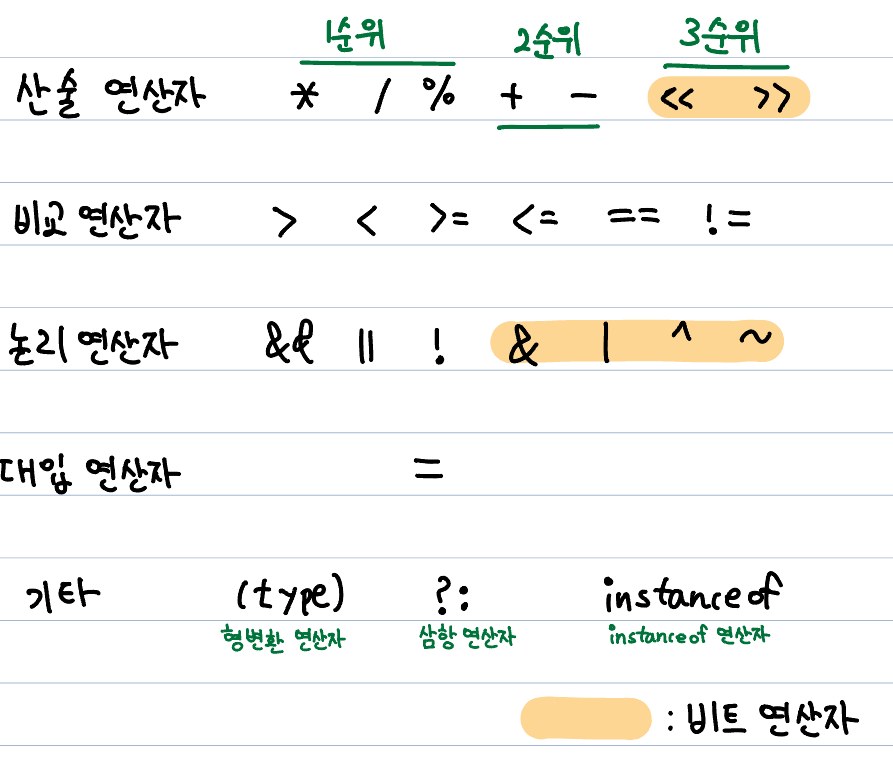

# 연산자
- **연산자(operator)** : 연산을 수행하는 기호
- **피연산자(operand)** : 연산자의 작업 대상
- 연산자의 종류는 다음과 같다.



## 연산자 우선순위
- `x >> 4 + 3` 에선 4+3이 먼저 연산되고 쉬프트 연산이 연산된다.
    - `\`는 몫을 반환하고 `%`는 나머지를 반환한다. `%`는 모듈러라고 한다.
- 대입 연산자의 우선 순위가 가장 낮다.

## 산술 변환(usual arithmetic conversion)
- 피연산자의 데이터 형식이 일치해야 연산이 가능하다.
- `int` 타입과 `float` 타입의 피연산자를 곱한다고 할 때, `float`의 타입이 더 크므로 `int` 타입 피연산자는 `float` 타입으로 자동 형변환된다.
- 만약 `float`을 `int`로 바꿔야 하는 상황이라면, 변수 이름 앞에 `(type)`을 적어 형변환 시켜준다.<br/>

```
int i = 10;
float f = 50.0f;
int result = i*(int)f;
// result의 데이터 타입은 정수, 값은 500
```
> 결국 산술 변환이란, 용어가 좀 거창하지만, 연산 직전에 발생하는 자동 형변환일 뿐이다.
(자바의 정석, 92p)
>> 1. 두 피연산자의 타입을 같게 일치시킨다.
>> 2. 피연산자의 타입이 int보다 작으면 int로 변환된다.

## 단항 연산자
- **증감 연산자** ++, --
    - ++는 피연산자를 1 증가, --는 1 감소
    - 전위형은 값이 참조되기 전 증가시킴
    - 후위형은 값이 참조된 후 증가시킴
```
int post = 0;
int pre = 0;
System.out.print(post++); // 0 출력
System.out.print(post); // 1 출력

System.out.print(pre); // 0 출력
System.out.print(++pre); // 1 출력
```
## 산술 연산자
- 피연산자가 정수면 0으로 나눌 수 없다. 나누면 에러뜸
- 정수형으로 나눗셈 연산 시 소수점이 버려진다. 정확한 값을 알고 싶다면 실수형으로 변환한 뒤 연산한다.
### 문자도 사칙연산이 가능하다.
- 문자는 유니코드로 저장된다. 문자간 사칙연산은 정수간 사칙 연산과 유사하게 동작한다.
```
char a = 'a';
char b = 'b';
char A = 'A';
char B = 'Z';
System.out.print(a+1); // b 출력
System.out.print(--b); // a 출력
System.out.print((int) a ) // 97 출력
System.out.print((int) A ) // 65 출력
System.out.print(A - A) // 정수 0 출력
```
- **A의 유니코드는 65, a의 유니코드는 97, 0의 유니코드는 48**

## 비교 연산자
### 대소비교 연산자
- `> < <= >=`이다. `boolean`형 외에 모든 기본 자료형에 사용 가능하다. 참조형에는 사용 불가능하다.
### 등가비교 연산자
- `== !=`이다. 기본 자료형, 참조 자료형 모두 사용 가능하다.
- 참조 자료형에 사용할 경우, 주소값을 비교한다.
- 즉, 객체의 데이터 값이 같아도 **저장된 주소 값** 이 다르면 `==` 기준 `false`가 반환된다.
- **형이 같을 때** 비교 가능함 당연함

### 문자열 비교
- `== !=` 대신 `.equals()` 메소드를 사용하여 비교한다.
- 메소드를 사용할 경우 객체의 값을 비교하고, 연산자를 사용할 경우 주소를 비교하기 때문이다.


## 논리 연산자
- `&& || !`이 있다. `&&`는 AND 연산자, `||`는 OR 연산자, `!`는 논리 부정 연산자라고 한다.
- AND 연산자는 양쪽의 논리가 `TRUE` 일때만 `TRUE`이다.
- OR 연산자는 하나의 논리만 `FALSE`여도 `FALSE`이다.
- 연산의 판단은 왼쪽부터 이루어지므로, AND 연산자로 비교할 때 왼쪽 논리가 `FALSE`이면 연산을 멈추고 `FALSE`를 반환한다. 이를 **효율적인 연산 short cut evaluation** 이라고 한다.
- 피연산자가 `TRUE`이면 `FALSE`를, `FALSE`이면 `TRUE`를 반환한다.

```
boolean flag = ( 1+3 > 2 && 1+3 < 2); // false가 저장됨
flag = ( 1+3 > 2 || 1+3 < 2); // true가 저장됨
flag  = !flag; // true의 반대값 false가 저장됨
```

## 비트 연산자
- `& | ^ ~ >> <<`가 있다.
- 피연산자를 비트 단위로 논리 연산한다. 즉 비트 단위로 조작한다.
    1. `&`는 AND 연산자. 두 피연산자의 비트가 1일 때 1을 반환한다. 그 외엔 0을 반환한다.
    2.  `|` 는 OR 연산자, 한쪽만 1이어도 1을 반환한다. 그 외의 경우는 0을 반환한다.
    3. `^`는 XOR 연산자, 두 피연산자의 비트 값이 서로 다를 때만 1을 반환한다. 그 외엔 0을 반환한다.
    4. `~` 비트 전환 연산자, 0비트를 1로, 1비트를 0으로 바꾼다.
    5. `>> <<` 쉬프트 연산자, 피연산자의 비트를 자릿수만큼 이동시킨다.
- OR 연산자는 특정 비트값을 바꿀 때 사용한다고 한다.
```
int i = 8; 00001000(2)인 상태
int tmp = ~i; // 11110111(2)가 된다.

8 << 2;는 다음과 같다.
// 0 0 0 0 1 0 0 0
// 0 0 1 0 0 0
// 0 0 1 0 0 0 0 0
// 결과 값은 32가 된다.
// 초과된 값은 사라지고, 빈 자리값은 0으로 채워진다.
```

## 조건 연산자
- 삼항 연산자라고 한다.
```
int result = (1 > 2) ? 10 : 100;
// 1 > 2는 false이므로 100이 저장된다.

result = (1 < 2) ? 10 : 100;
// 1 < 2는 true 이므로 10이 저장된다.
```

## 대입 연산자
- `=`는 항상 값을 반환함.
- 복합 대입 연산자는, 자기 자신을 대상으로 한 연산의 축어임
```
int i = 1;

i += 10; // 11, i = i + 10;
i -= 10; // 1, i = i = 10;
i *= 10; // 10, i = i * 10;
i /= 10; // 1, i = i / 10;
i %= 1; // 0, i = i % 1;

i <<= 3; // i = i << 3;
i >>= 3; // i = i >> 3;
i &= 3; // i = i & 3;
i ^= 3; // i = i ^ 3;
i |= 3; // i = i | 3;
```