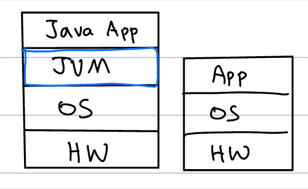
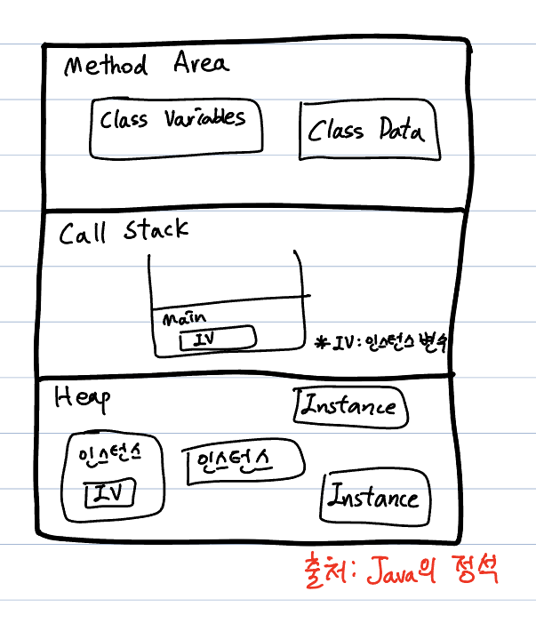

# 자바 가상 머신 Java Virtual Machine
### 자바 응용 프로그램을 실행하기 위한 가상 머신(소프트웨어)
### 1. JVM의 대략적인 구조

- JVM을 거치기 때문에 실행 속도가 느리다.
- 이는 JIT 컴파일러의 등장과 최적화 기법으로 어느정도 개선되었다.
- JIT 컴파일러는 컴파일된 Java 코드를 기계어로 변환하여 하드웨어(HW)로 전달한다.

### 2. Java 파일 동작 순서
1. 개발자가 작성한 자바 소스코드를 실행시키면, 자바 컴파일러가 소스 코드(.java)를 읽어 바이트코드(.class) 코드로 컴파일한다.
2. 바이트 코드는 JVM의 클래스 로더(Class Loader)에 전달된다. 클래스 로더는 필요한 클래스를 JVM의 메모리 영역에 올린다.
3. 필요한 클래스만 로드되는 건 동적 로딩(Dynamic Loading)에 의해 가능한 것이며, 요청하는 메모리는 OS가 할당해준다.
4. 실행 엔진(Execution Engine)이 JVM 메모리 영역의 바이트 코드를 명령어 단위로 해석해 실행한다.
    - **인터프리터**는 명령어를 하나씩 읽어 실행 시킨다. 개별 명령어는 빠르게 실행 되나 전체 속도는 느려진다.
    - **JIT 컴파일러**는 바이트 코드 전체를 컴파일하여 바이너리 코드로 변경하고 실행시킨다. 

 

# JVM의 메모리 구조
응용 프로그램이 실행되면 JVM은 시스템으로부터 메모리를 할당 받는다. JVM은 메모리를 여러개로 나누어 사용하는데, 주요 3가지 영역이 있다. 

1. 메서드 영역(Method Aread)
2. 호출 스택(Call Stack, Execution Stack)
3. 힙(Heap)

## Method Area 메서드 영역
프로그램 실행 중 사용되는 클래스에 대한 정보를 저장한다. **클래스 변수**도 함께 생성된다.

## Call Stack 호출 스택
메서드의 작업에 필요한 메모리 공간을 제공한다. 메서드 호출 시 메서드의 지역 변수, 중간 연산 결과 등을 저장한다. 메서드 종료 시 메모리 공간은 반환되어 지워진다.

## Heap 힙
인스턴스가 생성되는 공간이다. 프로그램 실행 중 생성되는 모든 인스턴스는 **힙**에 생성되며, **인스턴스 변수**도 이에 해당된다.

#### 참고
- [JVM 구조와 JAVA의 동작 원리](https://velog.io/@sgwon1996/JAVA%EC%9D%98-%EB%8F%99%EC%9E%91-%EC%9B%90%EB%A6%AC%EC%99%80-JVM-%EA%B5%AC%EC%A1%B0)
- [자바 컴파일 과정 & JVM 내부 구조](https://velog.io/@minseojo/Java-%EC%9E%90%EB%B0%94-%EC%BB%B4%ED%8C%8C%EC%9D%BC-%EA%B3%BC%EC%A0%95-JVM-%EB%82%B4%EB%B6%80-%EA%B5%AC%EC%A1%B0)

- 자바의 정석(도서)

